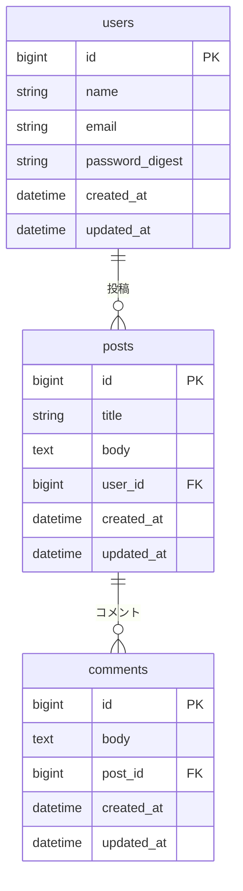
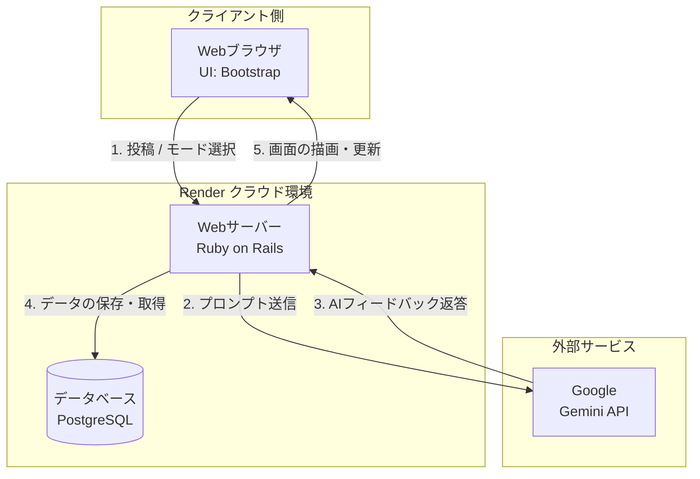

### 1. サービス概要

アウトプットの最初の一歩を支援するサービス

### 2. 解決したい課題

アウトプットに対する心理的ハードルを和らげる。

- 何を発信したらいいかわからない
- どう思われるのか不安
- うまい文章を作れない

### 3. 開発背景

- プログラミング学習において、多くの科学的根拠がアウトプットの重要性を示唆している
- 自己開示によってコミュニティとのつながりが生まれ、挫折を防げた経験がある
- アウトプットをしないことでの機会損失をしている人を少しでも減らしたい

### 4. ターゲットユーザー

- プログラミング学習を始めて間もない初学者
- 日々の投稿に心理的抵抗がある人

### 5. 主要機能

- **AIフィードバック機能**：投稿に対してAIがポジティブかつ具体的なアドバイスを返信
- **非公開練習モード**：誰にも見られずに「出す」ことに慣れるための環境
- **話題テンプレ**：「今日は何を学んだ？」といったテンプレートの提供

### 6. 技術選定

- **バックエンド**：Ruby 3.1.4、Ruby on Rails 7.0.3
    - 開発スピードとコミュニティの知見を重視
- **フロントエンド**：JavaScript / Bootstrap
    - 独自のCSS設計に時間を割くよりも、プロダクトの本質的な価値の検証を優先
- **AI**：Gemini 3.1 Flash-Lite
    - 高速のレスポンスに優れた、3月4日に発表された最新のモデル
- **インフラ**：Render
    - MVPとして価値を最速でユーザーに届けるため
- **コンテナ**：Docker
    - 環境の差異をなくし、開発効率を上げるため

### 7. プロンプト

- **優しめ**：「あなたは世界一優しいメンターです。どんなに小さなアウトプットも全力で褒め、自己肯定感を爆上げしてください。」
- **普通**：「あなたは親しみやすい学習仲間です。共感しつつ、次に繋がるようなアドバイスを1つだけ添えてください。」
- **厳しめ**：「あなたは現役のシニアエンジニアです。プロの視点から、成長につながるアドバイスを1つだけ添えてください。」

### 8. ER図

### 9. 画面遷移図

- トップページ(root)
- 投稿一覧（index / show)
- 投稿詳細(edit / destroy)
- 新規投稿投稿(new / create)
- 新規ユーザー登録(user_new)?
- ログイン(session_new / session_destroy)?

### 10.インフラ構成図

